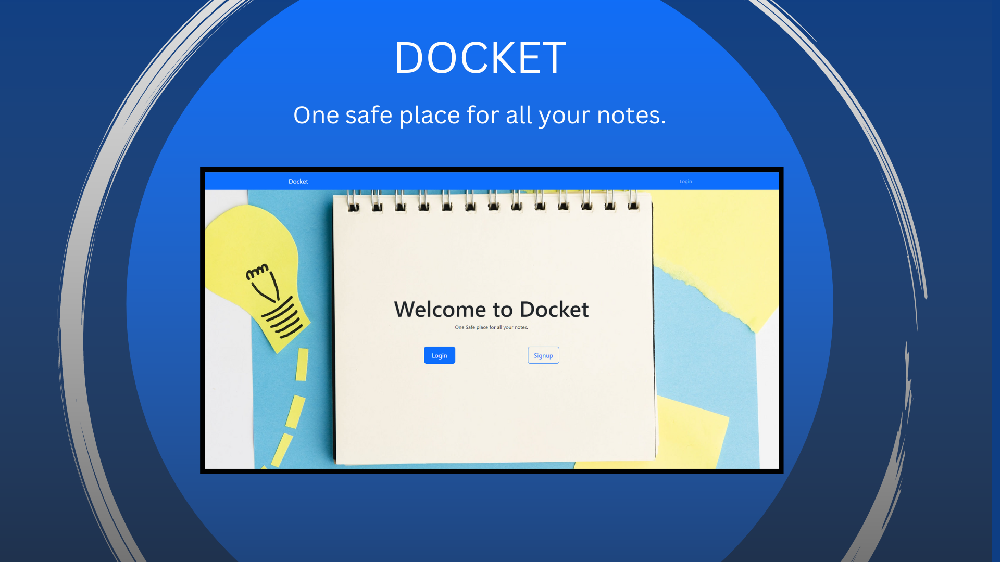

# TASK APP

<!-- Project name: MERN-Notezipper
username: notezipper
mongoDB pass: kgl0sH6YF5IGvGwJ
check out bootswatch.com for free premade templates of bootstrap -->

<!-- Npm packages | Shorthand react component boilerplate [rafce]
Backend --
[dotenv] - Loads environment variables from a .env file.
[express] - is a back end web application framework for building RESTful APIs with Node.js
[nodemon] - It simply restarts the node application whenever it observes the changes in the file present in the working directory of your project.
[concurrently] - lets you run frontend and backend with one command.npm run start.
[cors] - CORS is a node.js package for providing a Connect/Express middleware that can be used to enable CORS with various options.
[mongoose] - Provides everything that lets us connect to mongoDB.
[] -

Frontend --
[bootstrap react-bootstrap] - used for fast styling
[emailjs-com] - used to send emails in the form.
[mapbox-gl maplibre-gl react-map-gl] - works with the maps
[react-scroll react-scroll-motion] - effects on scroll into view
[react-toastify] - makes a toast appear when form is submited
[react-router-dom] - lets you change content on click in page.
[axios] - links backend and frontend. Makes api calls easy.
[] -
-->

Note Zipper is a full-stack web app that stores all your notes in one safe place. Check out the website yourself with the link below!

Website URL: [https://docket.herokuapp.com/](https://docket.herokuapp.com/)

## Bugs

- The edit functionality is not confirming the edits when submitted.
- When you first create an account, you have to refresh the page.

## Technologies

- HTML | CSS
- JavaScript | React
- Node.js
- MongoDB Atlas
- Git | Github
- React-Bootstrap
